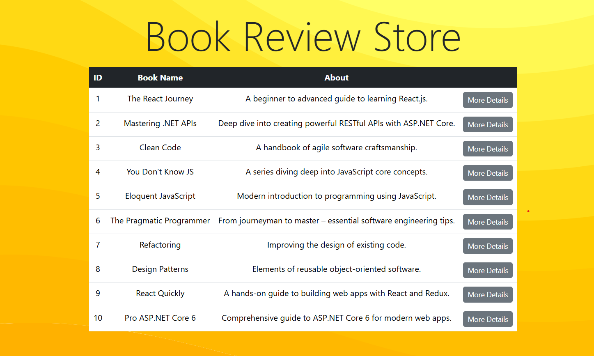
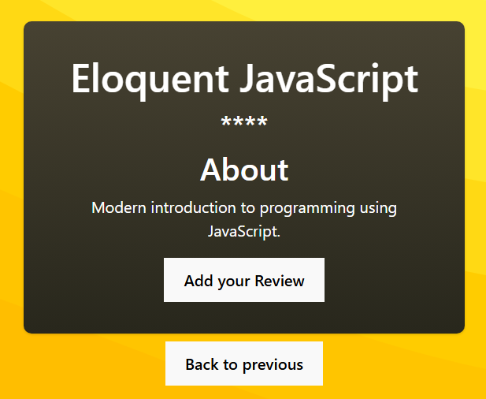
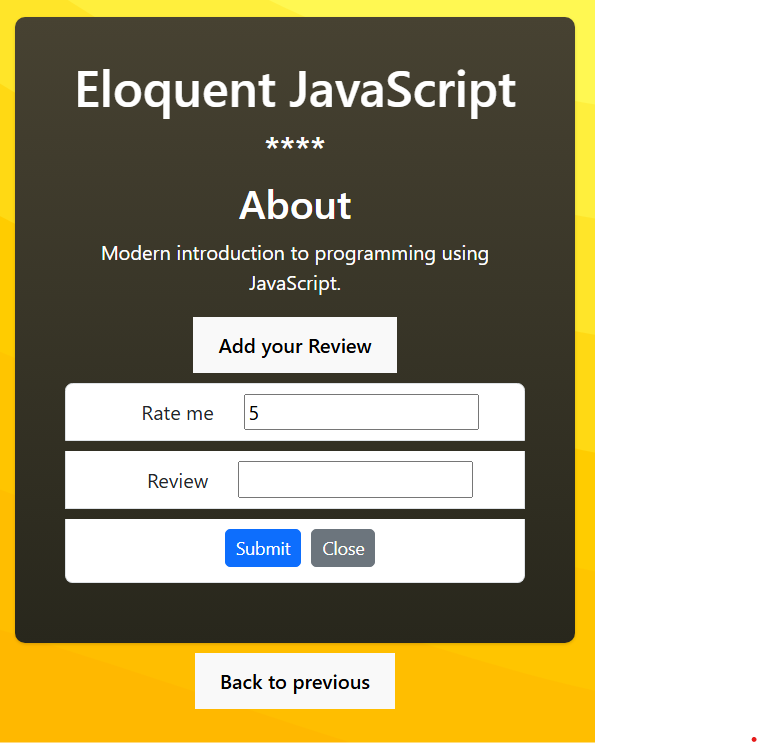

<!-- # BookReviewApp

Book Review App shows all the available book (latest book).
Book Lover can visit to this site and  get the insights of reviews till now based on rating.
And also mention their feedback to express their experience.

WorkFlow:
This page open when visit to website

Reader can choose desired book, and get the details about that book.
Rating is shown based on review received till that time.
For user experience showing stars.

Readere can share own experience by clicking on "Add review".
 -->

# 📚 BookReviewApp

**BookReviewApp** is a user-friendly platform where book lovers can explore the latest books, read community reviews, and share their own reading experiences.

---

## 🌟 Features

- 🔍 **Discover Latest Books**  
  View a curated list of newly added books as soon as the user visits the site.

- ⭐ **Read Reviews & Ratings**  
  Check ratings based on feedback from other readers. Ratings are visually shown with stars for a better user experience.

- ✍️ **Write & Submit Reviews**  
  Share personal thoughts about a book by submitting a review and rating.

---

## 🧭 Workflow Overview

### 🏠 Home Page – Book Listings

The homepage displays a collection of available books with their titles, thumbnails, and average ratings.

> 

---

### 📘 Book Details – Ratings & Reviews

Clicking on a book shows detailed information including:
- Description
- Star rating (based on cumulative reviews)
- User feedback

> 

---

### 💬 Add a Review

Users can click the **"Add Review"** button to write and submit their review along with a rating.

> 

---

## 📌 Tech Stack

- .NET Core Web API (Backend)
- Entity Framework Core (ORM)
- SQL Server (Database)
- React / Bootstrap / HTML / CSS (Frontend)
- Postman for API testing

---

## 🚀 Getting Started

1. Clone the repository  
   `git clone https://github.com/yourusername/BookReviewApp.git`

2. Navigate to the backend project folder  
   `cd BookReviewApp/Backend`

3. Run the application  
   `dotnet run`

4. Open in browser  
   Navigate to `http://localhost:PORT` (check console for actual port)

---

## 👥 Contribution

Pull requests are welcome. For major changes, please open an issue first to discuss what you’d like to change.

---

## 📄 License

This project is open source and available under the [MIT License](LICENSE).

